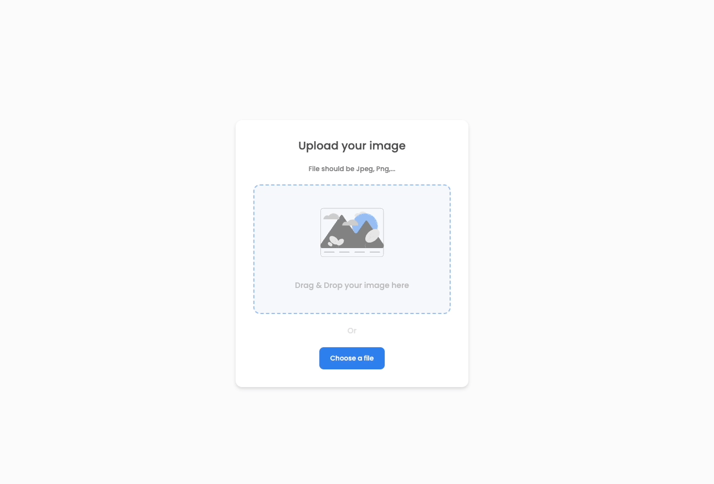

<!-- Please update value in the {}  -->

<h1 align="center">Upload Image</h1>

<div align="center">
   Solution for a challenge from  <a href="http://devchallenges.io" target="_blank">Devchallenges.io</a>.
</div>

<h1 align="center">
    Image Upload
</h1>
<p align="center">Upload you images</p>

<!-- OVERVIEW -->

## Overview



## About this project

This project was created as a challenge from the DevChallenge web page, fill free to contribuinte!

## Project UI 🎨

- [Figma - Image Upload](https://www.figma.com/file/NxbZm3CAovYh89dFXe7EOw/Image-Uploader?type=design&node-id=0-1&mode=design&t=5d2a0XajbbqJgUZG-0)

## Technologies 👩‍💻

- [NextJs](https://nextjs.org/)
- [Tailwind](https://tailwindcss.com/)
- [Typescript](https://www.typescriptlang.org/)
- [Supabase](https://supabase.com/)
- [React-Toastify](https://fkhadra.github.io/react-toastify/introduction)

Open [http://localhost:3000](http://localhost:3000) with your browser to see the result.

## Features

## How To Use

<!-- Example: -->

To clone and run this application, you'll need [Git](https://git-scm.com) and [Node.js](https://nodejs.org/en/download/) (which comes with [npm](http://npmjs.com)) installed on your computer. From your command line:

```bash
# Clone this repository
$ git clone https://github.com/your-user-name/your-project-name

npm i
npm run dev
# or
yarn
yarn dev
# or
pnpm i
pnpm dev
```

## License 📃

This project is under license from MIT. For more details, see the [LICENSE](./LICENSE.md) file.

### Author

---

Made by Artur Ceschin 👋🏼 Please fell free to contact me!
<br/>
[](https://www.linkedin.com/in/artur-peres-ceschin-programador/)
[](mailto:artur.ceschin@gmail.com)
